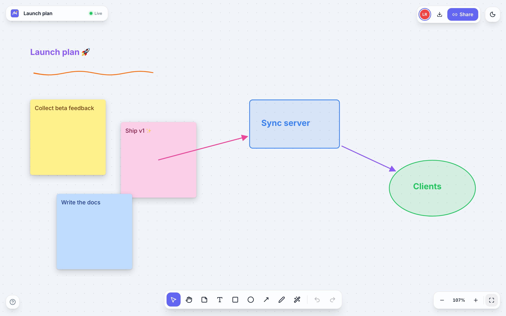

# Driftboard

A real-time collaborative whiteboard. Sticky notes, shapes, and freehand sketching on an infinite canvas. Share a link and collaborate instantly with live cursors and presence. No accounts, no setup.



**Live demo:** [driftboard-waem.onrender.com](https://driftboard-waem.onrender.com). Open it in two windows to see the sync. (Free-tier host: the first visit after idle takes ~30s to wake.)

## Features

- **Infinite canvas**: pan (space-drag, hand tool, trackpad), zoom to cursor (pinch / ⌘-scroll), zoom-to-fit
- **Sticky notes, text, rectangles, ellipses, arrows, and a pressure-sensitive pen** (smooth strokes via perfect-freehand)
- **Real-time multiplayer**: live cursors with name tags, presence avatars, edits appear as they happen
- **Cursor chat**: press `/` and talk right at your cursor, Figma-style
- **Laser pointer**: present with a fading trail everyone sees live
- **Remote selections**: see what each collaborator has selected, outlined in their color; click an avatar to jump to them
- **Conflict-free sync**: concurrent edits always merge cleanly, even after working offline
- **Scoped undo/redo**: undo only reverts *your* changes, never a collaborator's
- **Offline-ready**: boards persist locally in IndexedDB and reconcile on reconnect
- **Export to PNG**, marquee & multi-select, resize handles, duplicate, recolor, keyboard shortcuts for everything
- **Dark/light theme**, shareable board URLs, recent-boards list

## How it works

The interesting part is the sync engine. Driftboard is built on **CRDTs** (Conflict-free Replicated Data Types) using [Yjs](https://github.com/yjs/yjs):

- Each board is a `Y.Doc`. Every element (note, shape, stroke) is its own `Y.Map`, so concurrent edits merge **per field**: one person can recolor a note while another moves it, and both edits win.
- Pen strokes append points to a `Y.Array` while drawing, so collaborators watch strokes appear in real time rather than popping in at the end.
- The server ([server/index.ts](server/index.ts)) is a WebSocket relay implementing the y-websocket wire protocol directly on top of `yjs` + `y-protocols`: one room per board, document updates fan out to the room, and the awareness protocol carries ephemeral state (cursors, presence) that never touches the document.
- `Y.UndoManager` is scoped to a local transaction origin, which is what makes undo/redo respect only your own edits.
- `y-indexeddb` mirrors every board locally, so boards load instantly, work offline, and re-seed the server after a restart; the CRDT guarantees the merge is always clean.

Client: React 19, TypeScript, Vite, Tailwind CSS v4. The canvas is DOM/SVG rendered with a single world transform; no canvas framework, all interaction logic (pan/zoom math, marquee hit-testing, drag/resize state machines) is hand-rolled.

## Running locally

```bash
npm install
npm run dev        # web app on :5173, sync server on :1234
```

Open http://localhost:5173, create a board, then open the same board URL in a second window to see live sync.

## Production / deploy

The server serves the built client, so the whole app can run as a single Node process:

```bash
npm run build
npm start          # serves dist/ + WebSocket sync on $PORT
```

**One-service deploy (Render):** this repo ships a [render.yaml](render.yaml) blueprint. Create a new Blueprint on Render pointing at the repo and you're done. Also works on Railway or Fly with build `npm install --include=dev && npm run build`, start `npm start`.

**Split deploy (client on Vercel + sync on Render):** deploy the sync server with the blueprint above, then set `VITE_WS_URL=wss://<your-service>.onrender.com` in the Vercel project's environment variables and redeploy. The included [vercel.json](vercel.json) handles SPA route rewrites. Note the sync server must be a single long-lived process; room state is held in memory, so it can't run on serverless compute without adding external (e.g. Redis) coordination.

> Room state lives in server memory (clients re-seed it from IndexedDB on reconnect). For durable server-side persistence, add a LevelDB/Postgres snapshot layer in `server/index.ts`.

## Keyboard shortcuts

| Key | Action |
| --- | --- |
| `V` / `H` | Select / Hand |
| `N` `T` `R` `O` `A` `P` `L` | Sticky · Text · Rectangle · Ellipse · Arrow · Pen · Laser |
| `/` | Cursor chat |
| `⌘Z` / `⇧⌘Z` | Undo / Redo (your changes only) |
| `⌘D` | Duplicate selection |
| `⌫` | Delete selection |
| `Space`-drag | Pan |
| `⌘`-scroll / pinch | Zoom |
| Double-click | Quick sticky note / edit text |
| `?` | Shortcut help |

## Built by

[Chris Anorga](https://anorga.xyz), Full Stack Developer, San Diego.
